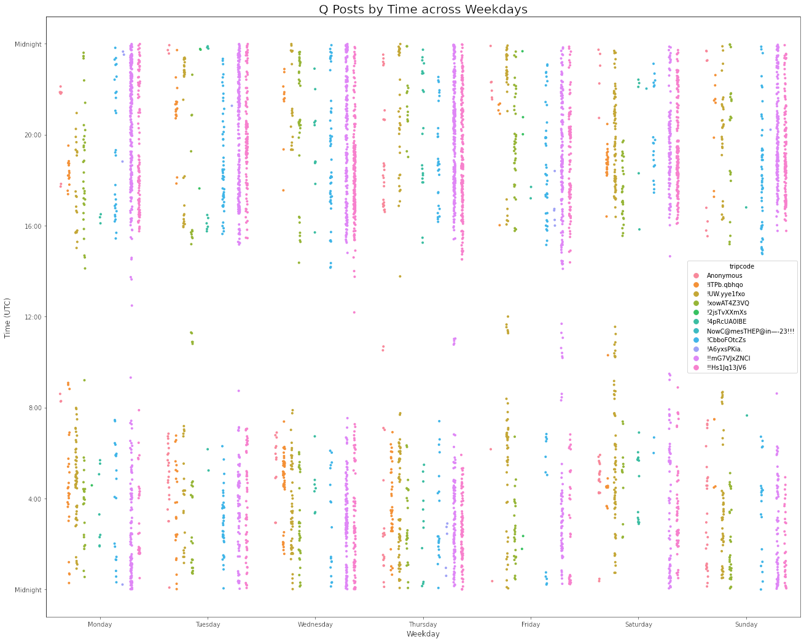
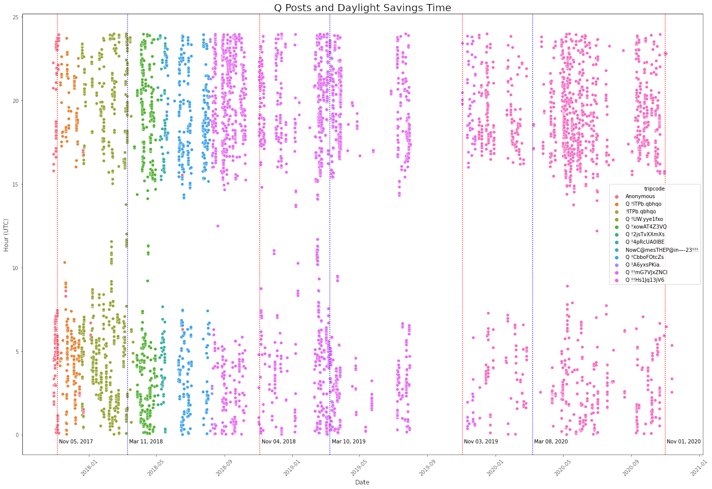

# Q Notebook

This repository contains metadata from Q drops, as well as an iPython notebook I have been using to investigate the data.


**Usage**

First, install [Jupyter Notebook](https://jupyter.org/) or Jupyter Lab.


Then, navigate to the project directory and install some dependencies:
```
pip install -r requirements.txt
```

Then, run `jupyter notebook` and open the file 'q_posts_analysis.ipynb'


Highlight the first cell of the notebook and run it with shift + Enter.


You now have all of the Q drop data loaded into memory in the Pandas DataFrame `df`! You can copy some of the example visualizations and tweak things as you like, or use whatever toolkit you are most comfortable with.

The example visualizations were made with Seaborn. You can find useful documentation [here](http://seaborn.pydata.org/).


## Featured Visualizations








